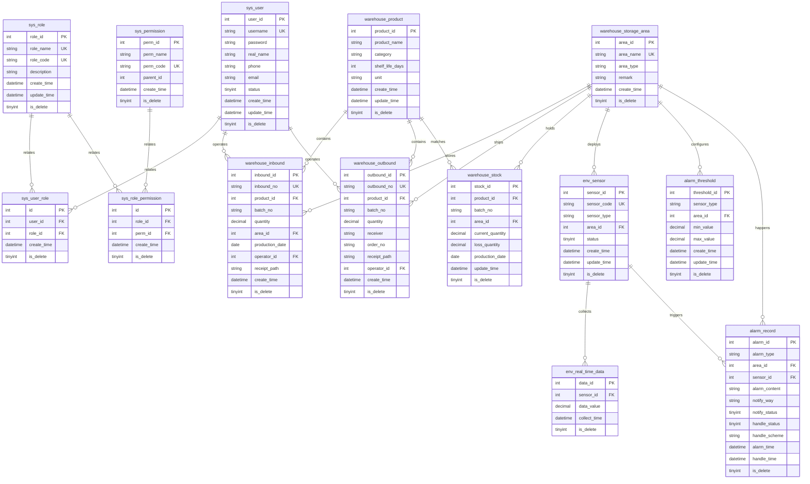

```mermaid

erDiagram
	sys_user {
		int user_id PK ""  
		string username UK ""  
		string password  ""  
		string real_name  ""  
		string phone  ""  
		string email  ""  
		tinyint status  ""  
		datetime create_time  ""  
		datetime update_time  ""  
		tinyint is_delete  ""  
	}

	sys_role {
		int role_id PK ""  
		string role_name UK ""  
		string role_code UK ""  
		string description  ""  
		datetime create_time  ""  
		datetime update_time  ""  
		tinyint is_delete  ""  
	}

	sys_user_role {
		int id PK ""  
		int user_id FK ""  
		int role_id FK ""  
		datetime create_time  ""  
		tinyint is_delete  ""  
	}

	sys_permission {
		int perm_id PK ""  
		string perm_name  ""  
		string perm_code UK ""  
		int parent_id  ""  
		datetime create_time  ""  
		tinyint is_delete  ""  
	}

	sys_role_permission {
		int id PK ""  
		int role_id FK ""  
		int perm_id FK ""  
		datetime create_time  ""  
		tinyint is_delete  ""  
	}

	warehouse_product {
		int product_id PK ""  
		string product_name  ""  
		string category  ""  
		int shelf_life_days  ""  
		string unit  ""  
		datetime create_time  ""  
		datetime update_time  ""  
		tinyint is_delete  ""  
	}

	warehouse_storage_area {
		int area_id PK ""  
		string area_name UK ""  
		string area_type  ""  
		string remark  ""  
		datetime create_time  ""  
		tinyint is_delete  ""  
	}

	warehouse_inbound {
		int inbound_id PK ""  
		string inbound_no UK ""  
		int product_id FK ""  
		string batch_no  ""  
		decimal quantity  ""  
		int area_id FK ""  
		date production_date  ""  
		int operator_id FK ""  
		string receipt_path  ""  
		datetime create_time  ""  
		tinyint is_delete  ""  
	}

	warehouse_outbound {
		int outbound_id PK ""  
		string outbound_no UK ""  
		int product_id FK ""  
		string batch_no  ""  
		decimal quantity  ""  
		string receiver  ""  
		string order_no  ""  
		string receipt_path  ""  
		int operator_id FK ""  
		datetime create_time  ""  
		tinyint is_delete  ""  
	}

	warehouse_stock {
		int stock_id PK ""  
		int product_id FK ""  
		string batch_no  ""  
		int area_id FK ""  
		decimal current_quantity  ""  
		decimal loss_quantity  ""  
		date production_date  ""  
		datetime update_time  ""  
		tinyint is_delete  ""  
	}

	env_sensor {
		int sensor_id PK ""  
		string sensor_code UK ""  
		string sensor_type  ""  
		int area_id FK ""  
		tinyint status  ""  
		datetime create_time  ""  
		datetime update_time  ""  
		tinyint is_delete  ""  
	}

	env_real_time_data {
		int data_id PK ""  
		int sensor_id FK ""  
		decimal data_value  ""  
		datetime collect_time  ""  
		tinyint is_delete  ""  
	}

	alarm_threshold {
		int threshold_id PK ""  
		string sensor_type  ""  
		int area_id FK ""  
		decimal min_value  ""  
		decimal max_value  ""  
		datetime create_time  ""  
		datetime update_time  ""  
		tinyint is_delete  ""  
	}

	alarm_record {
		int alarm_id PK ""  
		string alarm_type  ""  
		int area_id FK ""  
		int sensor_id FK ""  
		string alarm_content  ""  
		string notify_way  ""  
		tinyint notify_status  ""  
		tinyint handle_status  ""  
		string handle_scheme  ""  
		datetime alarm_time  ""  
		datetime handle_time  ""  
		tinyint is_delete  ""  
	}

	sys_user||--o{sys_user_role:"relates"
	sys_role||--o{sys_user_role:"relates"
	sys_role||--o{sys_role_permission:"relates"
	sys_permission||--o{sys_role_permission:"relates"
	sys_user||--o{warehouse_inbound:"operates"
	sys_user||--o{warehouse_outbound:"operates"
	warehouse_product||--o{warehouse_inbound:"contains"
	warehouse_product||--o{warehouse_outbound:"contains"
	warehouse_product||--o{warehouse_stock:"matches"
	warehouse_storage_area||--o{warehouse_inbound:"stores"
	warehouse_storage_area||--o{warehouse_outbound:"ships"
	warehouse_storage_area||--o{warehouse_stock:"holds"
	warehouse_storage_area||--o{env_sensor:"deploys"
	warehouse_storage_area||--o{alarm_threshold:"configures"
	warehouse_storage_area||--o{alarm_record:"happens"
	env_sensor||--o{env_real_time_data:"collects"
	env_sensor||--o{alarm_record:"triggers"
```